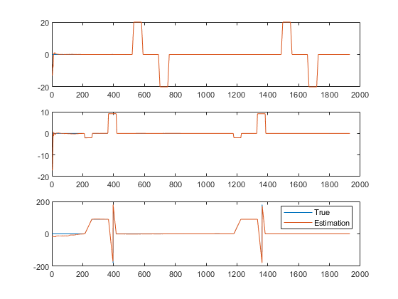
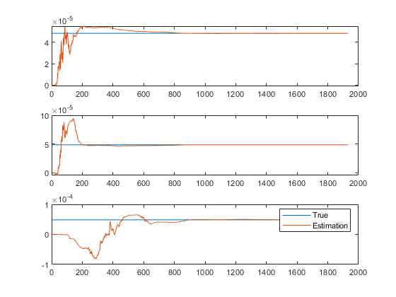
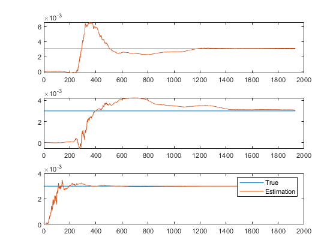
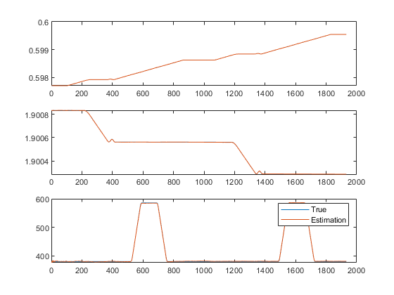
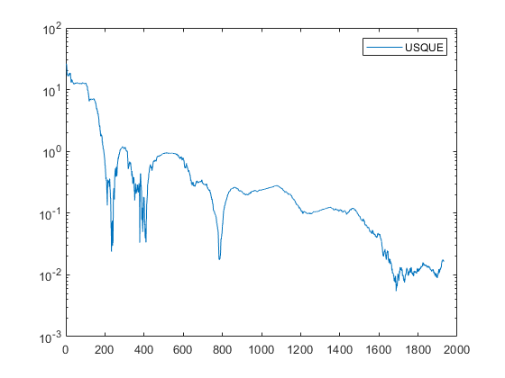
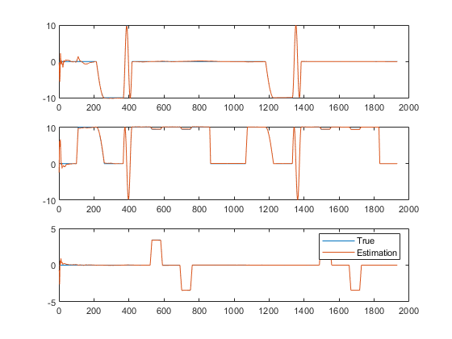
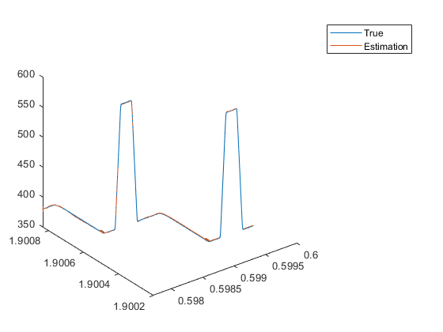

# QPF
---
QPF is a quaternion particle filter that use quaternion serve as state variable.

#### Some reference as follow:
Cheng, Y. and J. Crassidis (2004). Particle Filtering for Sequential Spacecraft Attitude Estimation. AIAA Guidance, Navigation, and Control Conference and Exhibit.

	
Lefferts, E. J., et al. (1982). "Kalman Filtering for Spacecraft Attitude Estimation." Journal of Guidance, Control, and Dynamics 5(5): 417-429.
	
Oshman, Y. and A. Carmi (2006). "Attitude Estimation from Vector Observations Using a Genetic-Algorithm-Embedded Quaternion Particle Filter." Journal of Guidance, Control, and Dynamics 29(4): 879-891.
	
Psiaki, M. L. (2000). "Attitude-Determination Filtering via Extended Quaternion Estimation." Journal of Guidance, Control, and Dynamics 23(2): 206-214.
	
Woodman, O. J. <An introduction to inertial navigation.pdf>.

# USQUE
---
USQUE is an Unscented Filtering that use unscented kalman filter to estimate the error of quaternion.

#### Some reference as follow:
	
Crassidis, J. L. and F. L. Markley (2003). "Unscented Filtering for Spacecraft Attitude Estimation." Journal of Guidance, Control, and Dynamics 26(4): 536-542.

Crassidis, J. L. (2005). Sigma-Point Kalman Filtering for Integrated GPS and Inertial Navigation. AIAA Guidance, Navigation, and Control Conference and Exhibit, San Francisco, California, AIAA.
	
CRASSIDIS, J. L. (2006). "Sigma-point_Kalman_filtering_for_integrated_GPS_and_inertial_navigation." Ieee Transactions on Aerospace and Electronic Systems.
	
Rudolph, V., et al. (2004). Sigma-Point Kalman Filters for Nonlinear Estimation and Sensor Fusion: Applications to Integrated Navigation. AIAA Guidance, Navigation, and Control Conference, Rhode Island.

# RESULT
## simualtion result:

attitude

gyroscope bias

accelerate bias

position

rotation angle error.png

velocity

vehicle trajectory